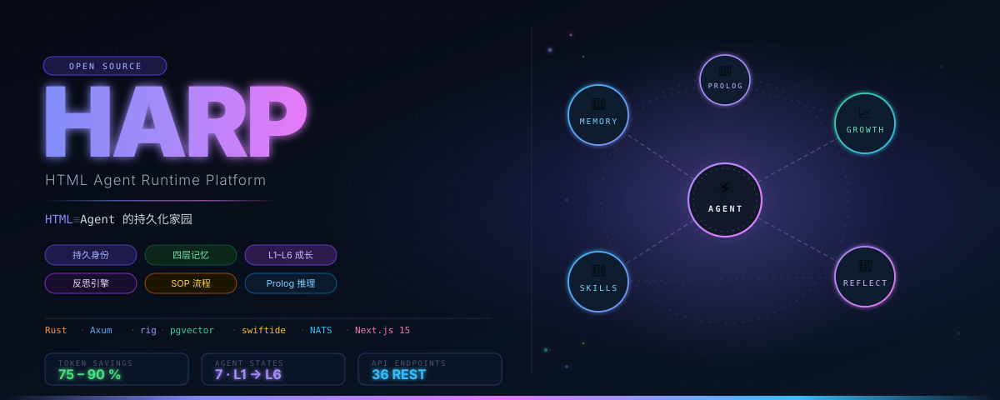

# HARP — HTML Agent Runtime Platform

<p align="center">
  
</p>

> **HTML = Agent 的持久化家园**

HARP 是一个持久化 AI Agent 运行时平台。Agent 不是一次性调用，而是拥有持久身份、记忆、成长轨迹和反思能力的软件实体。

---

## 核心理念

```
HTML = Agent 的持久化家园
一个 Agent = 一个有灵魂的软件实体，永久存在于云端
```

每个 Agent 具备：
- 🧠 **持久记忆**：Working / Short-Term / Long-Term / Organization 四层
- 📈 **成长体系**：L1-L6 等级，GrowthScore 驱动升级
- 🔁 **反思引擎**：任务完成后自动反思，提炼洞见
- 🔧 **技能系统**：SKILL.md 定义，Agent 运行时可自建技能
- 🧩 **Prolog 推理**：任务分配/升级/SOP 条件由逻辑规则驱动

---

## 技术栈

| 层级 | 技术 |
|------|------|
| 后端运行时 | Rust + Tokio + Axum 0.7 |
| LLM 客户端 | rig-core 0.38（20+ providers）|
| 向量存储 | PostgreSQL 16 + pgvector |
| RAG Pipeline | swiftide 0.38 |
| Agent 执行 | autoagents 0.32（ReAct）|
| 记忆注入 | rig-memory 0.38（TokenWindowMemory）|
| 逻辑推理 | scryer-prolog 0.9（纯 Rust）|
| 事件总线 | NATS JetStream |
| 前端 | Next.js 15 + Zustand + shadcn/ui |
| 部署 | Railway（MVP）→ Fly.io → K8s |

---

## 快速启动（开发环境）

```bash
# 1. 复制环境变量
cp .env.example .env
# 填入 OPENAI_API_KEY, ANTHROPIC_API_KEY, JWT_SECRET

# 2. 启动基础设施
cd infra && docker compose up -d

# 3. 启动后端
cd backend && cargo run

# 4. 启动前端
cd frontend && npm install && npm run dev
```

访问 http://localhost:3000

---

## 项目结构

```
harp/
├── backend/          # Rust 后端（Axum + sqlx + rig + swiftide）
│   ├── src/
│   │   ├── api/      # HTTP 路由（36 个端点）
│   │   ├── agent/    # Agent 状态机 + 生命周期
│   │   ├── auth/     # JWT 认证（Access 15min / Refresh 7day）
│   │   ├── memory/   # 四层记忆 + 向量检索 + Token 注入预算
│   │   ├── skill/    # SKILL.md 解析 + 执行
│   │   ├── growth/   # GrowthScore + 升级引擎
│   │   ├── reflection/ # 反思引擎（ExtractorAgent）
│   │   ├── sop/      # SOP DAG 执行器
│   │   ├── prolog/   # scryer-prolog 业务规则
│   │   ├── llm/      # Token 优化：Semantic Cache + Prefix Cache
│   │   └── event/    # NATS JetStream 事件总线
│   └── migrations/   # PostgreSQL 迁移（advisory lock 防竞争）
├── frontend/         # Next.js 15 前端
│   └── src/
│       ├── app/      # App Router 页面
│       ├── components/ # shadcn/ui 组件
│       ├── store/    # Zustand 状态管理
│       └── lib/      # API Client + 工具函数
├── infra/            # Docker Compose（PG + Redis + NATS）
├── docs/             # 规划文档
│   ├── TDD.md        # 技术设计文档
│   ├── TECH_SPEC.md  # 完整技术规格（DDL/WS/API/部署）
│   └── TASK_LIST.md  # 实施任务总清单
└── .github/
    └── workflows/    # CI（Rust test + clippy + fmt；TS type-check + lint）
```

---

## 文档

- [技术设计文档 (TDD)](docs/TDD.md)
- [技术规格详细](docs/TECH_SPEC.md) — DDL / WebSocket / API / Prolog / 错误码 / 部署 / SKILL.md 模板
- [实施任务总清单](docs/TASK_LIST.md) — 可执行的逐条任务，含代码萃取路径

---

## Token 成本优化

三层缓存架构，预计节省 75-90% LLM Token 成本：

```
请求 → Semantic Cache（pgvector 相似度 ≥ 0.92，直接返回）
     → Prefix Cache（Anthropic cache_control，$0.30/M vs $3.00/M）
     → LLM（LLMLingua-2 写时压缩，4-20x 压缩比）
```

100 个 Agent 日运营成本估算：**~$1.2-3.6/day**（无缓存约 $12/day）

---

## Agent 7 状态机

```
Created → Activated → Working → Reflecting → Evolving → Activated（循环）
                                          ↘ Failed（可恢复）
                                          ↘ Archived（终止）
```

---

## License

MIT
